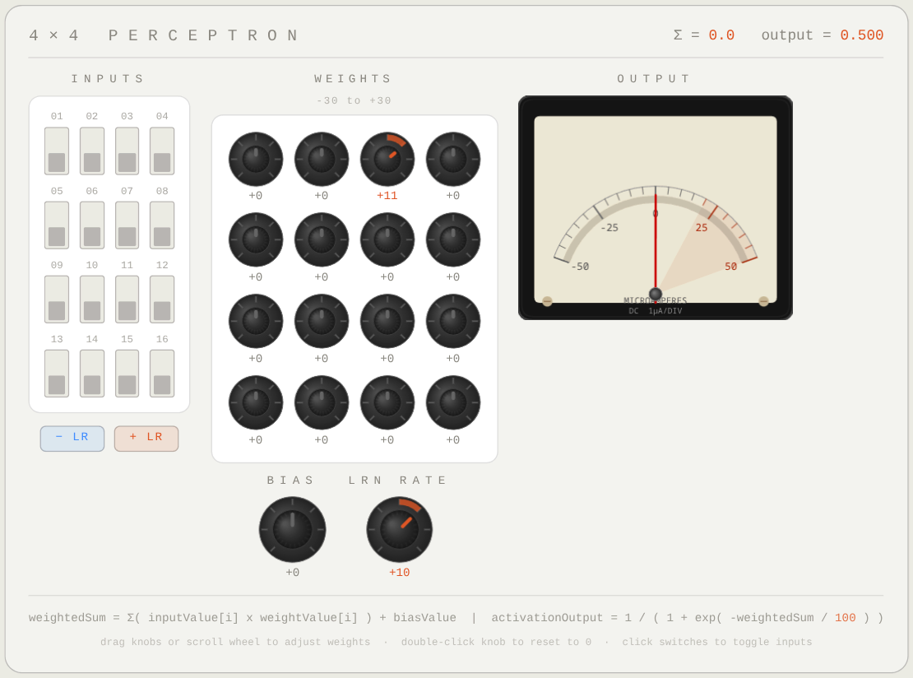

# Analog Perceptron Simulator

An interactive, browser-based single-neuron perceptron simulator with a skeuomorphic analog instrument UI. Toggle inputs, twist weight knobs, and watch an animated analog meter respond in real time.

Inspired by the perceptron demonstrated in the Welch Labs video: [ChatGPT is made from 100 million of these [The Perceptron]](https://www.youtube.com/watch?v=l-9ALe3U-Fg)



## How It Works

The simulator implements a single perceptron with a configurable N×N grid of binary inputs:

```
weightedSum = Σ( input[i] × weight[i] ) + bias
output = 1 / ( 1 + exp( -weightedSum / 100 ) )
```

- **Inputs** — A grid of toggle switches (on = 1, off = 0). Click to toggle.
- **Weights** — Rotary knobs ranging from −30 to +30, one per input. Drag vertically, scroll, or double-click to reset to zero.
- **Bias** — A single rotary knob added to the weighted sum.
- **Learning Rate** — Controls the step size of the +LR / −LR buttons, which adjust the weights of all currently-active inputs at once.
- **Output Meter** — An animated analog meter showing the sigmoid activation output (0 to 1).

## Usage

Open `index.html` in any modern browser. No build step, server, or dependencies required.

### Controls

| Control | Action |
|---|---|
| Click a switch | Toggle that input on/off |
| Drag a knob vertically | Adjust the weight value |
| Scroll wheel on a knob | Adjust the weight in steps |
| Double-click a knob | Reset weight to 0 |
| **+ LR** / **− LR** buttons | Nudge weights of all active inputs by the learning rate |

### Changing Grid Size

Edit the `GRID_SIZE` constant at the top of `perceptron.js` to any integer (e.g., 3, 5, 6) for an N×N perceptron.

## Files

| File | Description |
|---|---|
| `index.html` | Page structure and layout |
| `perceptron.js` | All simulation logic, knob/meter rendering, and interaction |
| `style.css` | Styling with light/dark mode support |
